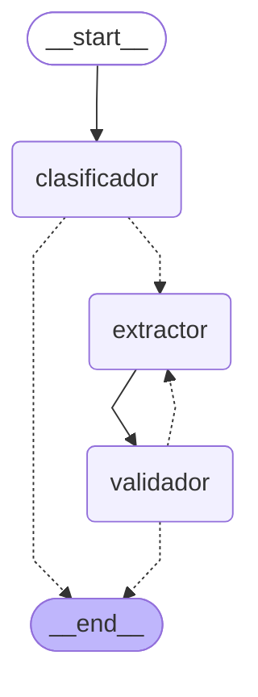

```mermaid
---
config:
  flowchart:
    curve: linear
---
graph TD;
	__start__([<p>__start__</p>]):::first
	clasificador(clasificador)
	extractor(extractor)
	validador(validador)
	__end__([<p>__end__</p>]):::last
	__start__ --> clasificador;
	clasificador -.-> __end__;
	clasificador -.-> extractor;
	extractor --> validador;
	validador -.-> __end__;
	validador -.-> extractor;
	classDef default fill:#f2f0ff,line-height:1.2
	classDef first fill-opacity:0
	classDef last fill:#bfb6fc
```